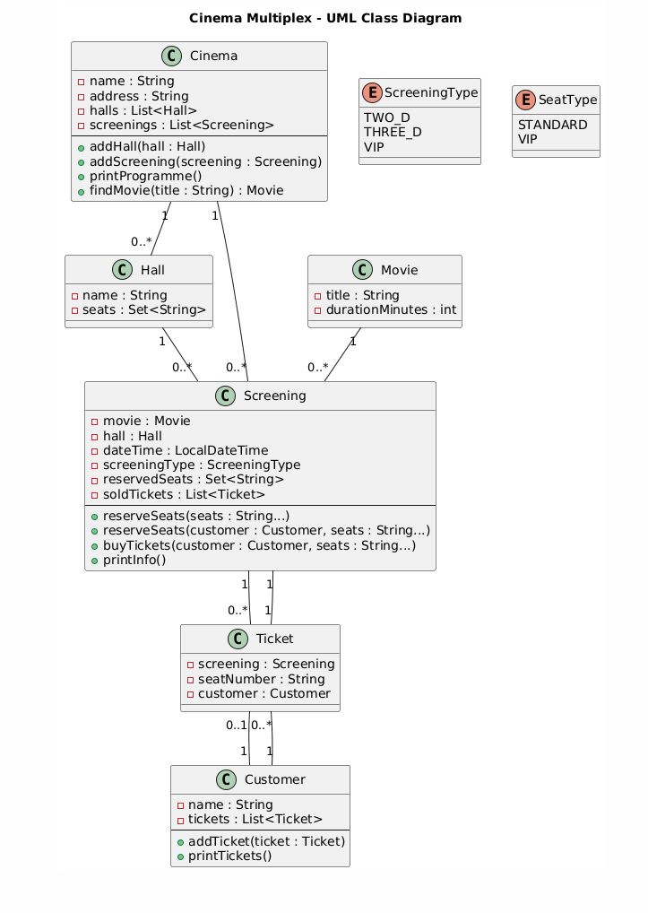
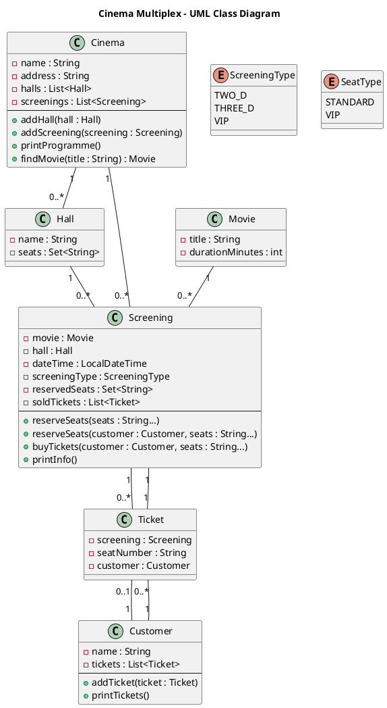

# Cinema Multiplex System

## UML Class Diagram

## UML Source (PlantUML)

```plantuml
@startuml

title Cinema Multiplex - UML Class Diagram

class Cinema {
    - name : String
    - address : String
    - halls : List<Hall>
    - screenings : List<Screening>
    --
    + addHall(hall : Hall)
    + addScreening(screening : Screening)
    + printProgramme()
    + findMovie(title : String) : Movie
}

class Hall {
    - name : String
    - seats : Set<String>
}

class Movie {
    - title : String
    - durationMinutes : int
}

class Screening {
    - movie : Movie
    - hall : Hall
    - dateTime : LocalDateTime
    - screeningType : ScreeningType
    - reservedSeats : Set<String>
    - soldTickets : List<Ticket>
    --
    + reserveSeats(seats : String...)
    + reserveSeats(customer : Customer, seats : String...)
    + buyTickets(customer : Customer, seats : String...)
    + printInfo()
}

class Ticket {
    - screening : Screening
    - seatNumber : String
    - customer : Customer
}

class Customer {
    - name : String
    - tickets : List<Ticket>
    --
    + addTicket(ticket : Ticket)
    + printTickets()
}

enum ScreeningType {
    TWO_D
    THREE_D
    VIP
}

enum SeatType {
    STANDARD
    VIP
}

' ================= RELATIONSHIPS =================

Cinema "1" -- "0..*" Hall
Cinema "1" -- "0..*" Screening

Hall "1" -- "0..*" Screening
Movie "1" -- "0..*" Screening

Screening "1" -- "0..*" Ticket
Customer "1" -- "0..*" Ticket

Ticket "0..1" -- "1" Customer
Ticket "1" -- "1" Screening

@enduml
```